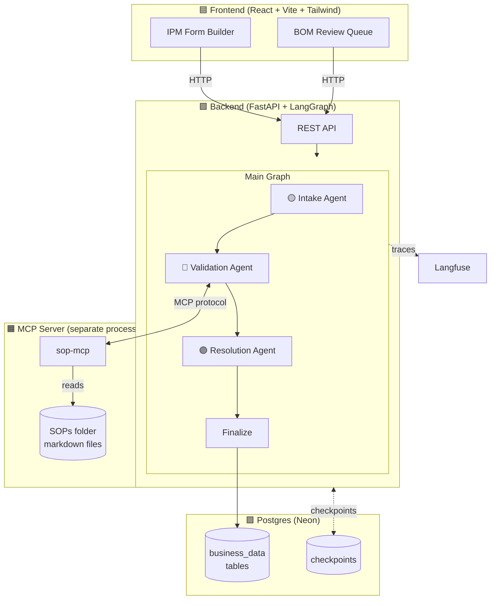
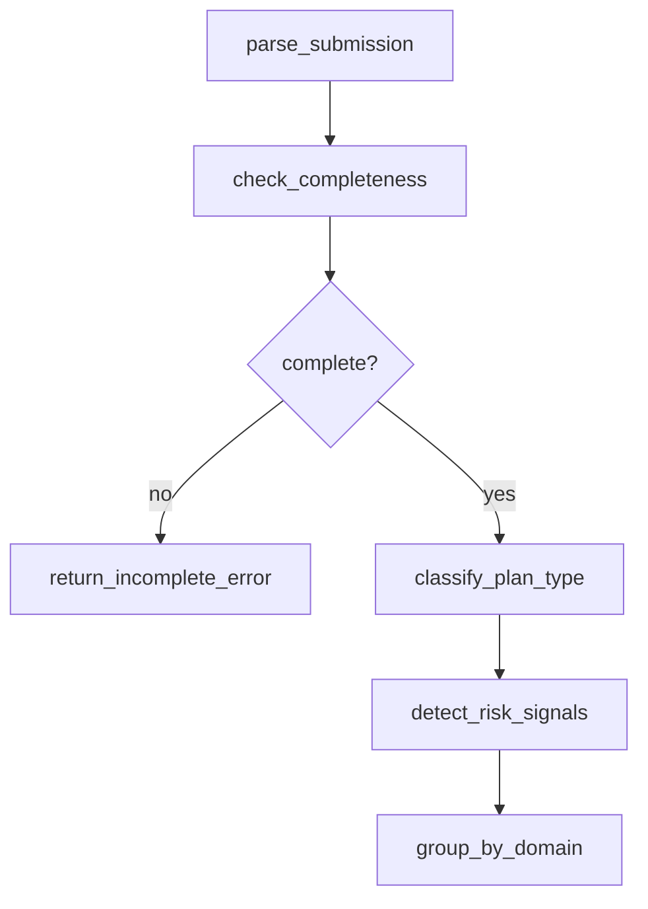
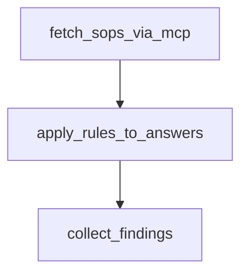
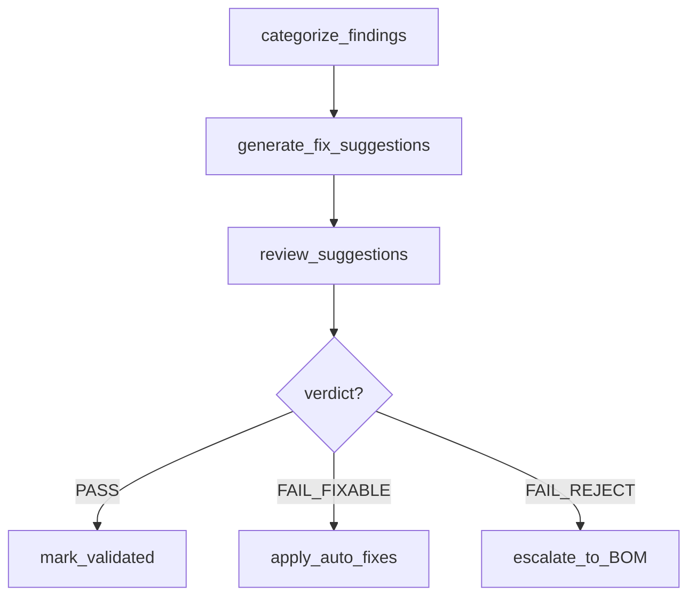
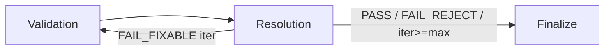

# Architecture — AI_Onboarding_Platform

This document explains how the system is wired together: the three agents,
the MCP server, the HITL pause point, and how state flows between them.

## High-level diagram

## The three agents

Each agent is its own LangGraph subgraph (in `backend/agents/<name>/`),
compiled separately, and used as a node in the main graph.

### 🟡 Intake Agent — `backend/agents/intake/`

Reads the IPM's submission and prepares it for validation.

| Node | What it does | Uses LLM |
|---|---|---|
| `parse_submission` | Normalize raw JSON, resolve qid→value mapping | No |
| `check_completeness` | Verify required fields filled (incl. conditional requireds) | No |
| `classify_plan_type` | Determine HMO/PPO/HDHP/EPO from answer patterns | Yes |
| `detect_risk_signals` | Scan for anti-patterns to flag for validator | Yes |
| `group_by_domain` | Split answers into accumulator/financial/clinical | No |
| `return_incomplete_error` | Fast-fail if required fields missing | No |

### 🔵 Validation Agent — `backend/agents/validation/`

Loads SOPs via MCP, applies rules, collects findings.

| Node | What it does | Uses LLM |
|---|---|---|
| `fetch_sops_via_mcp` | Call sop-mcp server for each domain's rules | No (uses MCP) |
| `apply_rules_to_answers` | Run each rule deterministically | No |
| `collect_findings` | Bundle results with severity | No |

This is the agent that **demonstrates MCP**. It never reads SOP files
directly — it talks to the sop-mcp server through the MCP protocol.

### 🟣 Resolution Agent — `backend/agents/resolution/`

Decides what to do with findings — auto-fix, pass, or escalate to BOM.

| Node | What it does | Uses LLM |
|---|---|---|
| `categorize_findings` | Sort into pass/warning/fixable/reject buckets | No |
| `generate_fix_suggestions` | LLM proposes structured patches | Yes |
| `review_suggestions` | Critic emits verdict | Yes |
| `apply_auto_fixes` | Apply approved patches | No |
| `mark_validated` | Mark submission as validated | No |
| `escalate_to_BOM` | Insert human_reviews rows for HITL pause | No |

## Self-correction loop

If the Resolution Agent applies auto-fixes (`FAIL_FIXABLE`), the main graph
routes control back to the Validation Agent. This loops at most
`MAX_SELF_CORRECTION_ITERATIONS` times (default: 1).

## HITL pause

When the verdict is `FAIL_REJECT`, the Resolution Agent's
`escalate_to_BOM` node inserts rows into `business_data.human_reviews`
and finalizes the submission with status `pending_human_review`.

The BOM analyst's decision (via the `/api/reviews/{id}/decision` endpoint)
resolves the review and updates the submission status.

## MCP — Model Context Protocol

The agent never touches SOP files directly. All access goes through the
`sop-mcp` server, which runs as a **separate process** and communicates
via stdio.

**Tools exposed by sop-mcp:**

- `list_sops` — catalog of available SOPs
- `get_sop_by_domain` — full markdown for a domain
- `extract_rules_for_domain` — structured rules parsed from a SOP
- `search_sop_rules` — free-text search across all SOPs

**Why this matters:** Today SOPs are local markdown. Tomorrow they could
move to Confluence, SharePoint, or any other system. The agent code
doesn't change — only the MCP server implementation does.

## Fault tolerance

`PostgresSaver` checkpoints state after **every** node — including inside
subgraphs. If the backend crashes mid-validation, invoking the graph with
the same `thread_id` resumes from the last successful node.

Checkpoint tables live in the **public schema** (not business_data),
avoiding Neon pooler search_path issues.

## State flow

The `MainState` TypedDict (`backend/graph/state.py`) is the shared dict
passed between subgraphs. Each agent reads what it needs and writes new
keys; LangGraph merges them via reducers.

Key fields:

| Field | Set by | Read by |
|---|---|---|
| `submission`, `form_config` | API | Intake |
| `parsed_answers`, `answer_lookup` | Intake | Validation, Resolution |
| `plan_type` | Intake | Validation |
| `domain_groups` | Intake | Validation |
| `findings` | Validation | Resolution |
| `verdict`, `fix_suggestions` | Resolution | Main router, Finalize |
| `final_status` | Resolution / Finalize | API response |
