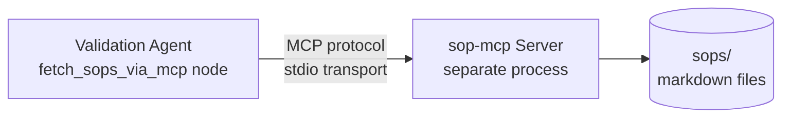

# How MCP Works in This Project

This document focuses specifically on the **Model Context Protocol (MCP)** —
what it is, why we use it, and how it shows up in AI_Onboarding_Platform.

## TL;DR

The agent never reads SOP files directly. It talks to a separate **sop-mcp
server process** through the MCP protocol. That server is the only thing
that touches the filesystem.

## Why does this matter when the files are local?

Fair question. The teaching value isn't about *where* the data lives — it's
about the **architectural pattern**.

Even with local files, going through MCP gives you:

1. **Protocol-based communication** — the agent uses the same MCP protocol
   it would use for Confluence, ServiceNow, or any other system
2. **Tool discovery** — the agent asks the server "what tools do you have?"
   at runtime; nothing is hardcoded
3. **Process isolation** — the MCP server is its own program with its own
   crash boundary
4. **Portability** — replace `sop-mcp` with `confluence-mcp` tomorrow and
   the agent code doesn't change a line

This is exactly the pattern production MCP usage follows.

## The architecture

Two processes:

1. **Backend** (the MCP client) — runs `uvicorn main:app`
2. **sop-mcp** (the MCP server) — runs `python server.py`

When `fetch_sops_via_mcp` node executes:

1. It uses `mcp.client.stdio` to spawn the sop-mcp server as a subprocess
2. It sends a `tools/call` request: `extract_rules_for_domain(domain="accumulator")`
3. The server reads the markdown file, parses rules, returns structured JSON
4. The agent receives the response and continues

## Tools exposed by sop-mcp

| Tool | Purpose |
|---|---|
| `list_sops` | Returns catalog of available SOPs with metadata |
| `get_sop_by_domain` | Returns full SOP markdown for a domain |
| `extract_rules_for_domain` | Returns structured rules parsed from a SOP |
| `search_sop_rules` | Free-text search across all SOPs |

Each tool is **self-describing** — it includes a name, description, and
input schema. The agent learns about these at runtime, not at compile time.

